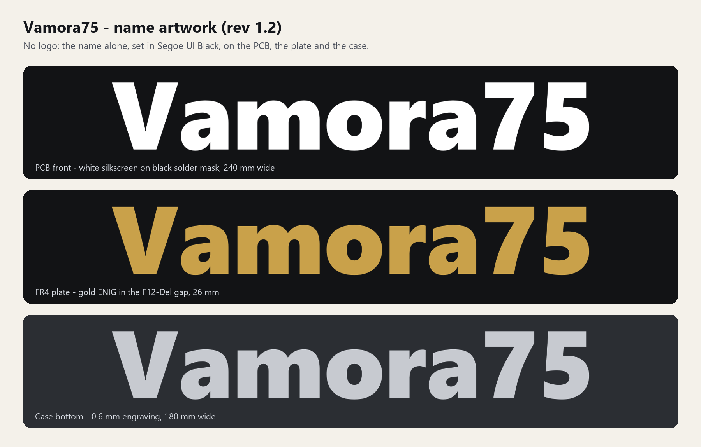

# Vamora75 name artwork

From rev 1.1 the board carries **no logo, only the name "Vamora75"**. It is set in Segoe UI
Black and is the same outline everywhere:

| Place | Size | Process |
|---|---|---|
| PCB front, across the middle of the board | 240 mm wide (about 72 % of the board) | White silkscreen on black solder mask, knocked out around every hole and exposed pad. Joe Scotto's switch outlines run through the letters; the tented vias are printed over. |
| FR4 plate, in the key-free F12-Del gap | 26 mm wide | Bare copper under a mask opening (gold with ENIG). From rev 1.2 the top case covers this gap, so the name shows only with the case open |
| Case bottom, centred | 180 mm wide | 0.6 mm engraving, can be paint-filled. The print-split seam is placed so it falls between two letters. |

Files:

| File | Use |
|---|---|
| `Vamora75_name_black.svg/.png` | Dark name, transparent background |
| `Vamora75_name_white.svg/.png` | White name, transparent background |
| `Vamora75_name_on_graphite.svg/.png` | White on the case colour (graphite) |
| `Vamora75_name_engrave.dxf` | Closed outlines in mm (CNC, laser, engraving) |
| `Vamora75_name_sheet.png` | Overview |

The geometry comes from `Source/vamora_logo.py` (`name_text`); regenerate with
`Source/export_artwork.py`. To use a different font, change `SEGOE_BLACK` there and rebuild
(`Source/build_all.py`) so the PCB, plate and case stay identical. The PCB back carries the
*Nam Quốc Sơn Hà* poem and the designers' names (Segoe UI Bold, generated by `Source/gen_artwork.py`). The rev 1.0 badge
(keycap with interlaced star and trilingual tagline) is kept in `Archive/rev1.0_outputs.zip`.
