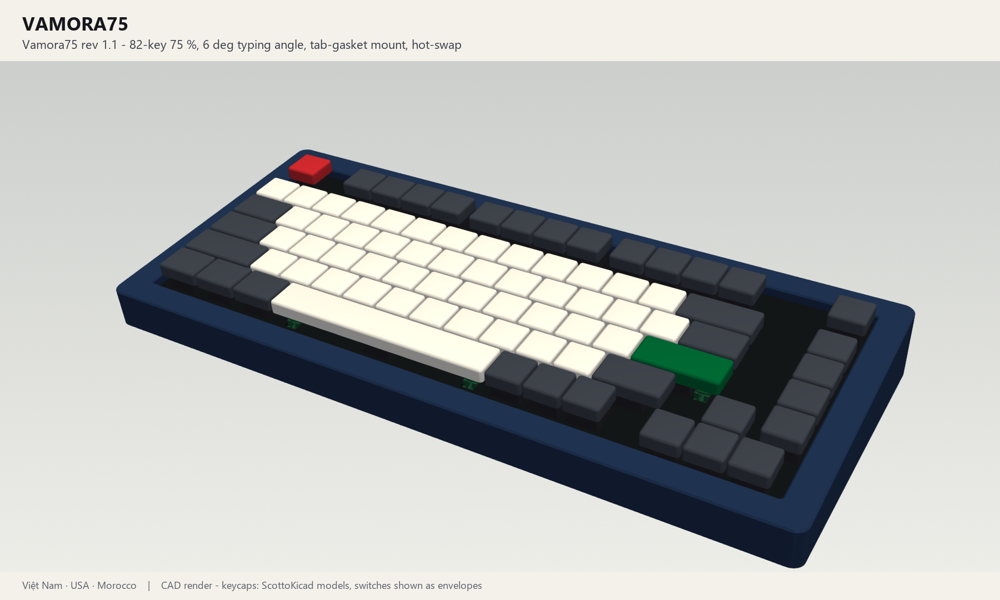
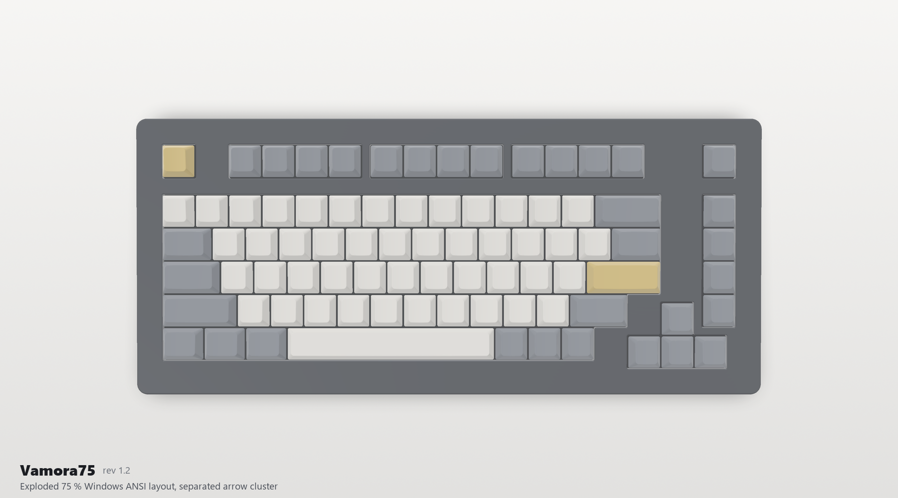
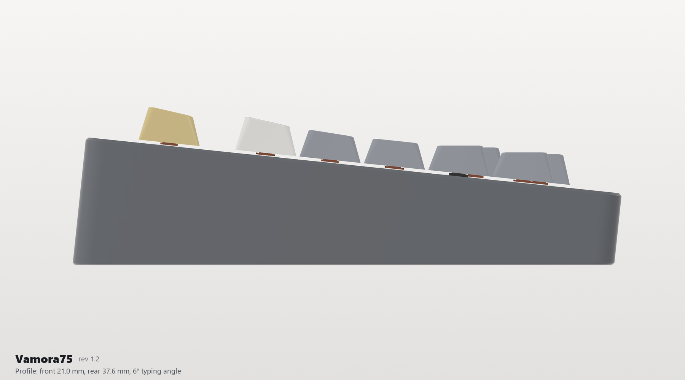
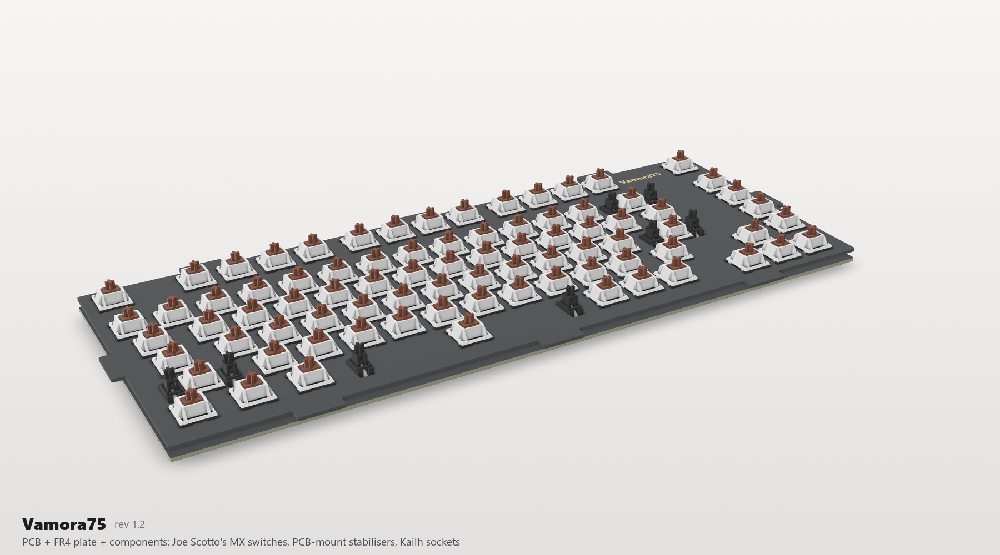
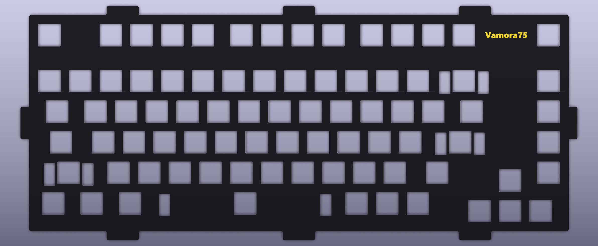

# Vamora75

**An 82-key 75 % mechanical keyboard with a 6° typing angle, a tab-gasket mount, hot-swap sockets
and an on-board RP2040.** Designed by **Kevin Le, Sammy DeGraaff and Mohammed-Mehdi Hamdaoui**.

> **Status: revision 1.2, complete and checked in software, not built yet.** ERC, DRC, schematic
> parity, plate DRC, 14 CAD interference checks and 30 firmware tests all pass
> ([validation/STATUS.md](validation/STATUS.md)). Build one prototype before a group order and work
> through the open items in [DESIGN_REVIEW.md](DESIGN_REVIEW.md).

## Features

- Exploded 75 % Windows ANSI layout, 82 keys, with a separated arrow cluster
- Hot-swap Kailh sockets for any 3- or 5-pin MX-compatible switch
- PCB-mount screw-in stabilisers on plated, copper-reinforced holes; the plate openings let the
  stabiliser housings pass through
- Tab-gasket sandwich mount: 8 plate tabs, 16 gaskets at 20 % compression, optional flex-cut plate
- 6° typing angle; two-piece case whose top follows the key clusters, so no plate shows between
  them; printed in one piece, in 4 pieces for 250 x 210 mm beds, or CNC
- RP2040 on the board (the Raspberry Pi Pico core circuit), USB-C, ESD protection, fuse, BOOT and
  RESET buttons
- QMK + VIA, or CircuitPython with no compiler
- Black PCB with ENIG gold; "Vamora75" across the PCB front, engraved under the case and in gold on
  the plate (under the top case); *Nam Quốc Sơn Hà* and the designers' names on the PCB back
- Generated from source: one command rebuilds the PCB, plate, case, firmware, manufacturing files,
  3D models and renders, then re-runs every check

## Gallery

| Exploded | Top |
|---|---|
|  |  |
| **Profile** | **Underside** |
|  |  |

**PCB + plate + components** (no case): Joe Scotto's MX switches, the PCB-mount stabilisers, Kailh
sockets and every SMD part ([3D file](Mechanical/Vamora75_PCB_plate.step),
[quick-look .glb](Mechanical/Vamora75_PCB_plate.glb)):

### PCB

| Front ("Vamora75" silkscreen) | Back (*Nam Quốc Sơn Hà*, designers, gold stabiliser rings) |
|---|---|
|  |  |
| **With Joe Scotto's switch models** | **FR4 plate (name in gold ENIG, under the top case)** |
|  |  |

## 3D files

| File | Shows | Open with |
|---|---|---|
| [Mechanical/Vamora75_assembly.step](Mechanical/Vamora75_assembly.step) | The whole keyboard: case, gaskets, foams, plate, PCBA, switches, stabilisers, keycaps | FreeCAD, Fusion 360, Onshape, SolidWorks |
| [Mechanical/Vamora75_PCB_plate.step](Mechanical/Vamora75_PCB_plate.step) | PCB + plate + every component, without the case | any STEP viewer |
| [Mechanical/Vamora75_PCB_plate.glb](Mechanical/Vamora75_PCB_plate.glb) | The same, as a light coloured model | Windows 3D Viewer, Blender, any web glTF viewer |
| [Mechanical/Vamora75_PCBA.step](Mechanical/Vamora75_PCBA.step) | The PCBA only (KiCad export) | any STEP viewer |
| [PCB/Vamora75.kicad_pro](PCB/Vamora75.kicad_pro) | Schematic and board; press Alt+3 for the 3D view | KiCad 10 |

Case parts, the plate and the soft parts are in [Mechanical/](Mechanical) as STEP/STL/DXF.

## Specifications

| | |
|---|---|
| Layout | 82 keys: exploded 75 % Windows ANSI with an F-row in clusters, a Del/Home/PgUp/PgDn/End column, a separated arrow cluster (0.25u gap), 1.75u RShift and 6.25u space ([layout](Previews/layout.png)) |
| Switches | Any MX-compatible switch, 3- or 5-pin, in Kailh CPG151101S11 hot-swap sockets (ScottoKicad `Hotswap_MX` footprints) |
| Stabilisers | PCB-mount screw-in: Backspace (2u), Enter and LShift (2.25u), Space (6.25u), standard orientation. Plated holes with 4.6 / 6.0 mm copper reinforcement rings; plate openings 7.0 x 14 mm |
| Controller | RP2040, W25Q16JV 2 MB flash, 12 MHz crystal (the Raspberry Pi Pico core circuit), BOOT and RESET buttons |
| USB | USB-C (HRO TYPE-C-31-M-12), USB 2.0 full speed, 5.1 kΩ CC resistors (C-C and A-C cables), USBLC6-2SC6 ESD protection, 0.5 A PTC fuse, XC6206 3.3 V LDO |
| Matrix | 6 x 16, COL2ROW, one 1N4148W per key |
| PCB | 334.61 x 134.59 mm, 2 layers, 1.6 mm, black solder mask, white silkscreen, ENIG. All SMT parts on the bottom (one-sided assembly), GND pour on both layers |
| Plate | FR4, 1.5 mm (1.6 mm also fits), black, 8 gasket tabs, optional flex cuts, "Vamora75" in gold ENIG |
| Mount | Tab-gasket sandwich: 16 gaskets of 20 x 4.5 x 2 mm at 20 % compression. PCB and plate float as one unit |
| Case | Two pieces, 6° typing angle, 21.0 mm high at the front and 37.6 mm at the rear, 358.6 x 161.5 mm. The top-case opening follows the key clusters (the case covers every gap between them). 8 M3 screws into heat-set inserts, "Vamora75" engraved underneath |
| Firmware | QMK + VIA, or CircuitPython |

## What you need

The full list is [Manufacturing/Vamora75_kit_BOM.csv](Manufacturing/Vamora75_kit_BOM.csv).

| Item | Qty | Notes |
|---|---|---|
| PCBA | 1 | Order from JLCPCB with the files in [Manufacturing/PCB](Manufacturing/PCB): black mask, ENIG, bottom-side assembly |
| FR4 plate | 1 | Ordered as a PCB: [Manufacturing/Plate](Manufacturing/Plate) |
| Case top + bottom | 1 | 3D printed (PETG/ASA) or CNC aluminium: [Mechanical/Case](Mechanical/Case) |
| MX-compatible switches | 82 | 3- or 5-pin |
| Keycaps | 1 set | 75 % kit with 1.75u RShift and 6.25u space |
| PCB-mount screw-in stabilisers | 4 | 3 x 2u + 1 x 6.25u |
| Gaskets, case foam, plate foam | | Cut from the DXFs in [Mechanical/Soft](Mechanical/Soft) |
| M3 x 8 screws, M3 heat-set inserts | 8 + 8 | |
| Bumpers | 4 | 10 x 3 mm |

## Getting started

1. Read [DESIGN_REVIEW.md](DESIGN_REVIEW.md): the mount, the stabilisers, what changed, and what to
   check on the first prototype.
2. Order the PCBA, the plate, the case and the soft parts:
   [Manufacturing/FABRICATION.md](Manufacturing/FABRICATION.md).
3. Assemble it: [BUILD_GUIDE.md](BUILD_GUIDE.md).
4. Flash the firmware: [Firmware/README.md](Firmware/README.md).
5. To change the design, edit the parameter files and rebuild: [Source/README.md](Source/README.md).

## Repository

| Folder | Contents |
|---|---|
| [PCB/](PCB) | KiCad 10 project: schematic, 2-layer board, project footprint library (ScottoKicad + KiCad stock) with 3D models, custom DRC rules |
| [Plate/](Plate) | KiCad boards for ordering the FR4 plate as a PCB (standard and flex-cut) |
| [Mechanical/](Mechanical) | Case (one-piece and 4-piece print split), plate DXF/STEP/STL, gasket and foam DXFs, assembly STEP, PCB + plate STEP/GLB, PCBA STEP, key positions |
| [Manufacturing/](Manufacturing) | JLCPCB-ready Gerbers/drill, BOM + CPL, schematic PDF, assembly drawing, plate Gerbers, kit BOM |
| [Firmware/](Firmware) | QMK + VIA source, VIA definition, CircuitPython, KLE layout |
| [Artwork/](Artwork) | The "Vamora75" name in SVG/PNG/DXF ([NAME.md](Artwork/NAME.md)) |
| [Previews/](Previews) | Renders |
| [Source/](Source) | Python generators for everything (`build_all.py`) |
| [validation/](validation) | ERC/DRC, mechanical, plate and firmware reports |
| [Archive/](Archive) | Earlier revisions: `rev0.1/`, `rev1.0_outputs.zip`, `rev1.1_outputs.zip` |
| [Reference/](Reference) | Input snapshots (Keyboard75, Aster75) |

## Revisions

- **1.2** (2026-10-03): top case covers the gaps between key clusters, plate openings and foam
  windows for PCB-mount stabilisers, plated and reinforced stabiliser holes, black PCB, designers'
  names on the PCB back, sculpted keycaps, new 3D files and renders.
- **1.1**: arrow cluster moved away from the nav column, Joe Scotto's ScottoKicad footprints and
  models, name-only branding.
- **1.0**: on-board RP2040, new matrix and routing, 6° gasket-mount case.

Details: [CHANGELOG.md](CHANGELOG.md).

## Credits

Designed by **Kevin Le, Sammy DeGraaff and Mohammed-Mehdi Hamdaoui** (team Vamora).

Footprints and 3D models for the switches, sockets, stabilisers and several components are from
Joe Scotto's [ScottoKicad](https://github.com/joe-scotto/scottokeebs). Third-party data and licences:
[ATTRIBUTION.md](ATTRIBUTION.md) and [Licenses/](Licenses).
