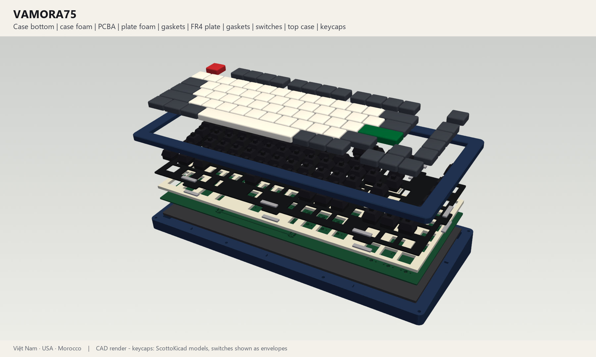
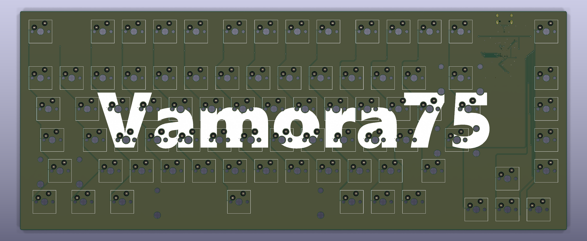
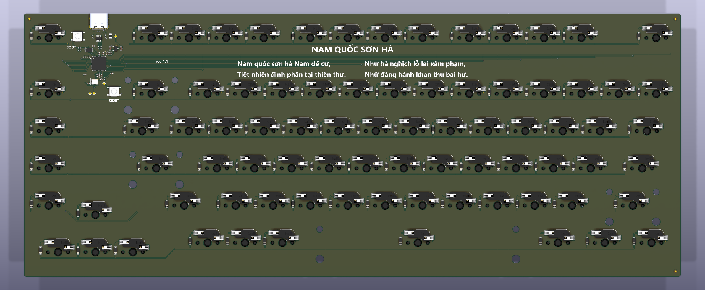
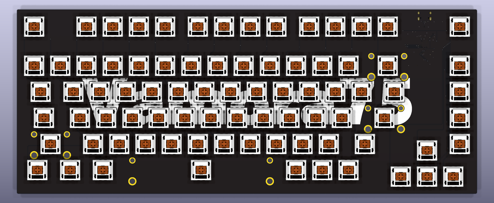
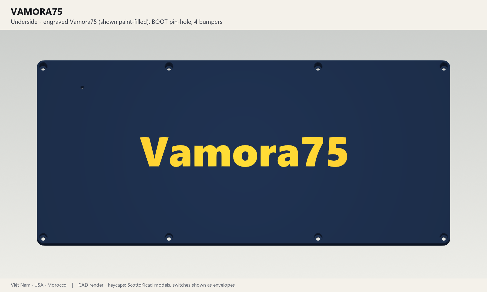

# Vamora75

Vamora75 assembled

Vamora75 is an 82-key, 75 % mechanical keyboard with a Windows ANSI layout. It has hot-swap
sockets, a tab-gasket mount, a 6° typing angle, an on-board RP2040 and USB-C. It was designed by
a Vietnamese, American and Moroccan team.

**Revision 1.1: complete and checked in software, not built yet.** ERC, DRC, schematic parity,
plate DRC, CAD interference checks and firmware tests all pass. See
[validation/STATUS.md](validation/STATUS.md) and the open items in
[DESIGN_REVIEW.md](DESIGN_REVIEW.md). Build one prototype before a group order.

What's new in 1.1 ([CHANGELOG.md](CHANGELOG.md)):
- The arrow cluster sits 0.25u left and 0.25u down, clear of the Del/Home/PgUp/PgDn/End column.
- The switch, stabiliser, diode, USB-C and passive footprints and 3D models come from Joe Scotto's
  ScottoKicad library; his MX switch model is shown on the PCB.
- No logo, only the name: a very large "Vamora75" across the PCB front, engraved under the case
  and in gold on the plate. The PCB back keeps the *Nam Quốc Sơn Hà* poem.

## Repository

| Folder | Contents |
|---|---|
| [PCB/](PCB) | KiCad 10 project: schematic, 2-layer board, project footprint library (ScottoKicad + KiCad stock) with 3D models, custom DRC rules |
| [Plate/](Plate) | KiCad boards for ordering the FR4 plate as a PCB (standard and flex-cut) |
| [Mechanical/](Mechanical) | Case (one-piece and 4-piece print split), plate DXF/STEP/STL, gasket and foam DXFs, full assembly STEP, PCBA STEP, key positions |
| [Manufacturing/](Manufacturing) | JLCPCB-ready Gerbers/drill, BOM + CPL, schematic PDF, assembly drawing, plate Gerbers, whole-kit BOM, [FABRICATION.md](Manufacturing/FABRICATION.md) |
| [Firmware/](Firmware) | QMK + VIA source, VIA definition, CircuitPython (no compiler needed), KLE layout |
| [Artwork/](Artwork) | The "Vamora75" name in SVG/PNG/DXF, see [NAME.md](Artwork/NAME.md) |
| [Previews/](Previews) | Renders |
| [Source/](Source) | Python generators for everything (`build_all.py`). See [Source/README.md](Source/README.md) |
| [validation/](validation) | ERC/DRC/mechanical/firmware reports |
| [Archive/](Archive) | `rev0.1/` (original project) and `rev1.0_outputs.zip` (previous revision, with the badge logo) |
| [Reference/](Reference) | Input snapshots (Keyboard75, Aster75) |

## Specifications

| | |
|---|---|
| Layout | 82 keys: exploded 75 % Windows ANSI with an F-row in clusters, a Del/Home/PgUp/PgDn/End column, a separated arrow cluster (0.25u gap), 1.75u RShift and 6.25u space ([layout](Previews/layout.png)) |
| Switches | Any MX-compatible switch, 3- or 5-pin, in Kailh CPG151101S11 hot-swap sockets (ScottoKicad `Hotswap_MX`) |
| Stabilisers | PCB-mount screw-in (ScottoKicad `Stabilizer_MX`): Backspace (2u), Enter and LShift (2.25u), Space (6.25u), all in standard orientation |
| Controller | RP2040, W25Q16JV 2 MB flash and 12 MHz crystal (the Raspberry Pi Pico core circuit), with BOOT and RESET buttons |
| USB | USB-C (HRO TYPE-C-31-M-12), USB 2.0 full speed, 5.1 kΩ CC resistors (works with C-C and A-C cables), USBLC6-2SC6 ESD protection, 0.5 A PTC fuse, XC6206 3.3 V LDO |
| Matrix | 6 x 16, COL2ROW, one 1N4148W per key |
| PCB | 334.61 x 134.59 mm, 2 layers, 1.6 mm, all SMT parts on the bottom (one-sided assembly), GND pour on both layers. "Vamora75" across the front silkscreen, *Nam Quốc Sơn Hà* on the back |
| Plate | FR4, 1.5 mm (1.6 mm also fits), 8 gasket tabs, optional flex cuts, "Vamora75" in gold (ENIG) |
| Mount | Tab-gasket sandwich: 16 gaskets of 20 x 4.5 x 2 mm, 20 % compression. PCB and plate float as one unit. |
| Case | Two pieces, 6° typing angle, 21.0 mm high at the front and 37.6 mm at the rear, 358.6 x 161.5 mm. 8 M3 screws into heat-set inserts. Print it in one piece or as 4 pieces (fits 250 x 210 mm beds), or machine it. "Vamora75" engraved underneath. |
| Firmware | QMK + VIA, or CircuitPython |

## Getting started

1. Read [DESIGN_REVIEW.md](DESIGN_REVIEW.md), which covers the gasket-mount question, what changed
   and what to check on the first prototype.
2. Order the PCBA, the plate, the case and the soft parts:
   [Manufacturing/FABRICATION.md](Manufacturing/FABRICATION.md).
3. Assemble it: [BUILD_GUIDE.md](BUILD_GUIDE.md).
4. Flash the firmware: [Firmware/README.md](Firmware/README.md).
5. To change the design, edit the parameter files and rebuild: [Source/README.md](Source/README.md).

| PCB front ("Vamora75" silkscreen) | PCB back (*Nam Quốc Sơn Hà*) |
|---|---|
|  |  |
| **PCB with Joe Scotto's switch models** | **Case bottom (engraved name)** |
|  |  |

## Credits

Designed by the Vamora team (Kevin Le, Sammy DeGraaff, Mohammed-Mehdi Hamdaoui). Footprints and 3D models for the switches,
sockets, stabilisers and several components are from Joe Scotto's
[ScottoKicad](https://github.com/joe-scotto/scottokeebs). For all third-party data and licences see
[ATTRIBUTION.md](ATTRIBUTION.md) and [Licenses/](Licenses).
